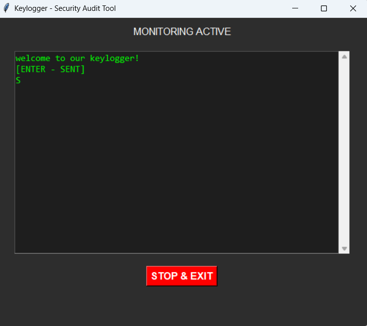

# Security Monitoring & Input Analysis Tool

Academic cybersecurity project developed in Python.

## Overview

This project demonstrates event monitoring, keyboard input analysis,
GUI development, encrypted local storage, and external service integration.

## Features

- Real-time keyboard event monitoring
- Active window detection
- Clipboard activity analysis
- GUI visualization
- Telegram notification support
- Encrypted local data storage
- Environment-based configuration

## Technologies

- Python
- Tkinter
- pynput
- pygetwindow
- pyperclip
- cryptography

## Screenshots

### Keylogger UI



## Installation

```bash
pip install -r requirements.txt
```

## Configuration

Create a `.env` file based on `.env.template`.

Required variables:

```env
TELEGRAM_TOKEN=YOUR_TOKEN
TELEGRAM_CHAT_ID=YOUR_CHAT_ID
ENCRYPTION_KEY=YOUR_KEY
```

## Run

```bash
python script.py
```

## Educational Purpose

This project was developed for academic and educational purposes
to demonstrate cybersecurity and software engineering concepts.
